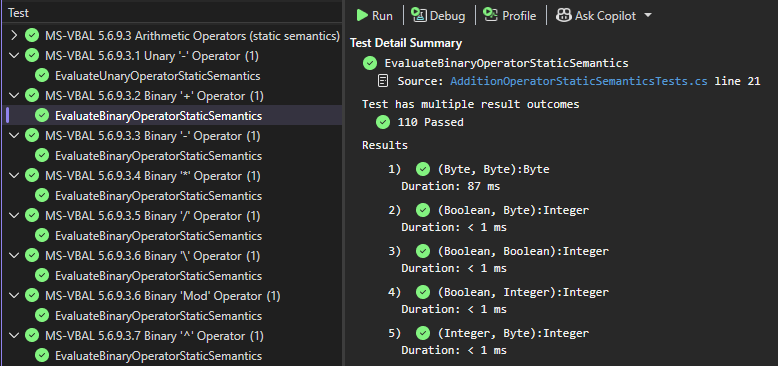
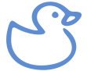

# RDCore™
[EN](./README.en.md) | [FR]

### Avant de commencer.
> 👋 Nouveau ici? Rubberduck a toujours été une initiative open-source.
> **RDCore l'honore avec une formule Open-Core**. Voir [rubberduckvba.ca](https://rubberduckvba.ca) pour plus de détails.

Ce référentiel contient différents projets **en phase de développement actif** produisant différentes librairies et exécutables sous un modèle de licence relativement simple :
- **La librairie RDCore.SDK** est sous licence **⚖️MIT**;
- **Tout le reste** est construit autour et sous licence **⚖️GPLv3**.

Cet arrangement protège tant les contributeurs historiques qu'actuels, tout en protégeant son avenir : **l'implémentation du _runtime_ de RDCore demeurera open-source**.

👉 Nous construisons ici une solide fondation pour le _coeur de langage_, mais veuillez noter qu'en ce moment le seul livrable est le [site de documentation](https://rubberduck-vba.github.io/rdcore).

---

# 1.0.1 RDCore
**RDCore**™ est une plateforme de _serveur de langage_ (LSP) dont les travaux d'implémentation sont **présentement en cours**. À la cible, les livrables de RDCore sont :
- 🎯 **rdc.exe**: un _environnement hôte_ RD-VBA configurable et extensible, client LSP (CLI);
- 🎯 **RDCore.LanguageServer.exe**: le serveur d'orchestration LSP de la plateforme;
- 🎯 **RDCore.Parser.exe**: le _parser_ de la plateforme est une application serveur LSP satellite détenue et orchestrée par le serveur de langage principal;
- 🎯 **RDCore.Diagnostics.exe**: une extension _core_ de la plateforme qui envoie les _diagnostics_ au serveur de langage principal de façon asynchrone;
- 👉 **RDCore.Runtime.dll**: une librairie renfermant l'implémentation de toute la sémantique et mécanismes du run-time de RD-VBA, _incluant une implémentation de la librairie VBA standard_;
- 🧩 **RDCore.SDK.dll**: une librairie exposant les abstractions de la plateforme RDCore et encapsulant les implémentations de base du _coeur de langage_ RD-VBA.

### ✨ Ce que RDCore rend envisageable
Entre autres :
- **Analyse sémantique** de code VBA à une profondeur que seuls des _analyseurs LSP_ peuvent atteindre
- **Exécution** de code VBA hors du VBIDE
- **Outils de développement** via le protocole _Language Server_ (LSP)
- **Inspection de l'exécution**, comportements et _faits sémantiques_ 
- **Extensions de la plateforme** avec des analyseurs et plug-ins

### 📊 Statut du projet
> [!NOTE]
> Cette section est tenue à jour à mesure que progresse l'implémentation.

RDCore est présentement en phase active de développement **pré-alpha** - le **seul livrable pour l'instant** consiste en sa **spécification** et sa **documentation**.  
- Architecture: ✅ stable
- SDK langage: ✅ largement défini
- Runtime: 🚧 implémentation en cours
- Librarie standard: 🚧 partiellement définie
- Parser: 🚧 existe (tout juste)
- Hôte CLI (rdc.exe): 🚧 existe (tout juste)
- **Contributions publiques: ❌ pas encore ouvertes**

# 1.0.2 RD-VBA
L'implémentation du _coeur de langage_ de la plateforme est également un **projet en cours de réalisation**. Ultimement, RD-VBA :

- 🎯 **vise une stricte adhésion aux spécifications MS-VBAL**, assurant une compatibilité comportementale avec les sémantiques spécifiées existantes de VBA;
- 🧩 **élève VBA en une plate-forme de langage moderne, extensible, et _entièrement open-source_**, séparant la _définition du langage_ de son _implémentation originale_ de 1993;
- 👀 **rend explicite les comportements implicites du langage** en exposant les règles sémantiques, étapes d'évaluation, piles d'appels, et états d'erreur en tant que _faits observables_.

## État de l'implémentation
> [!NOTE]
> Cette section est tenue à jour à mesure que progresse l'implémentation.

- ✅ Sémantiques _statiques_ IMPLÉMENTÉES pour les opérateurs  
- ✅ Sémantiques _statiques_ IMPLÉMENTÉES pour les _let-coercions_
- ✅ Sémantiques _runtime_ IMPLÉMENTÉEES pour tous les opérateurs
- 🚧 Sémantiques _runtime_ EN COURS pour _let-coercions_  
- 🎯 Sémantiques _runtime_ À FAIRE pour tous les _statements_  
- 🎯 Sémantiques _runtime_ À FAIRE pour la _librairie standard_  
- 🚧 Modélisation du pipeline d'évaluation EN COURS
- 🚧 Modélisation du pipeline d'analyse EN COURS  
- 🚧 Modélisation du pipeline d'exécution EN COURS

### Couverture de tests
- 🧪 couverture TOTALE (rdcore.sdk.dll): 17.4 %blocs; **15.0 %lignes** | ⚠️ SOUS LA CIBLE (>70%)

Des tests exercent les sémantiques statiques des opérateurs à travers une matrice de [VBIntrinsicType](https://rubberduck-vba.github.io/rdcore/api/RDCore.SDK.Model.Types.Abstract.VBIntrinsicType.html) qui traversent la plupart (toutes?) des combinaisons _spécifiées_ d'intrants:

  

👉 Manquants: tests pour toutes combinaisons _non spécifiées_ (s'il y a lieu), et conditions d'erreur / validations des _type mismatch_.

---
 [Accueil](https://rubberduck-vba.github.io/rdcore/index.fr.html) | ℹ️[Introduction](https://rubberduck-vba.github.io/rdcore/introduction.fr.html) | 🧩[Démarrage](https://rubberduck-vba.github.io/rdcore/getting-started.html) | 🎯[RD-VBAL](https://rubberduck-vba.github.io/rdcore/specs/rd-vbal.html) | [SDK](https://rubberduck-vba.github.io/api/RDCore.SDK.Model.Errors.VBCompileErrorId.html) | 🌐[rubberduckvba.ca](https://rubberduckvba.ca)

---

<h6 align='center'>V I V A T ❤️ C U C U M I S ™</h6>

 

<small>© Copyright <strong>9562-7303 Québec inc.</strong> (2026) <em>Seul, &quot;Rubberduck&quot; est utilisé pour fins de référence au projet open-source legacy <strong>utilisé publiquement ainsi depuis 2015</strong> et sans lien ni affiliation avec tout tiers détenteur d'une marque semblable dans quelque juridiction que ce soit. &quot;Rubberduck VBA&quot;, &quot;RDCore&quot; et &quot;VIVAT CUCUMIS&quot; sont des marques de commerce revendiquées par 9562-7303 Québec inc. (en attente); Toutes les marques appartiennent à leur détenteur respectif. RDCore n'est pas un produit de Microsoft et n'est pas affilié à Microsoft, ni directement, ni indirectement.  If used alone, <em>&quot;Rubberduck&quot; is used as a reference to the legacy open-source project <strong>the same way it has been used publicly since 2015</strong> and without any links or affiliation with any third-party trademark holders of a similar trademark in any jurdisdiction. &quot;Rubberduck VBA&quot;, &quot;RDCore&quot; and &quot;VIVAT CUCUMIS&quot; are trademarks claimed by 9562-7303 Québec inc. (pending). All trademarks belong to their respective owners. RDCore is not a Microsoft product and is not affiliated with Microsoft, directly or indirectly.</small>

