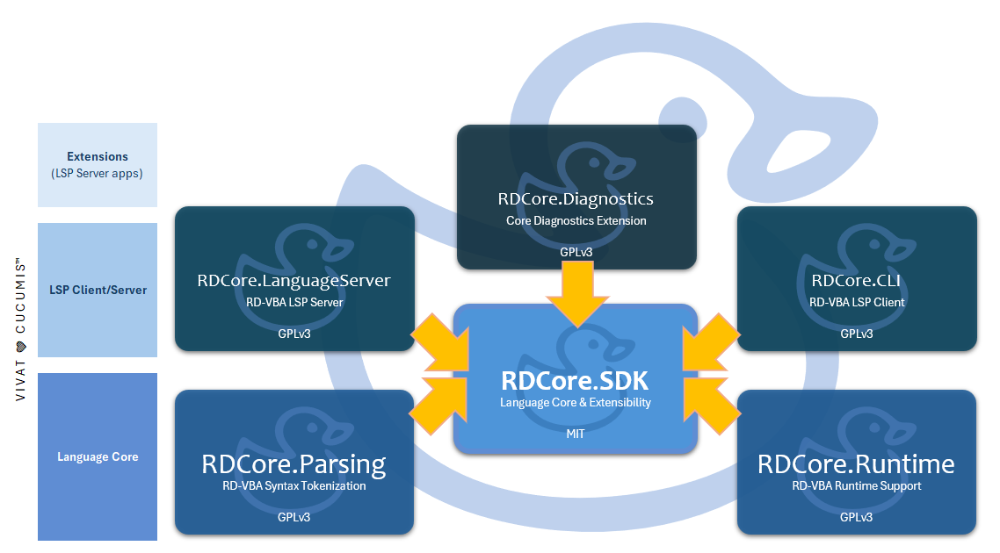

# RDCore™

[Anglais](./README.en.md)

### Avant de commencer.

> Nouveau ici? Rubberduck a toujours été une initiative open-source.
> **RDCore l'honore avec une formule Open-Core**. Voir [rubberduckvba.ca](https://rubberduckvba.ca) pour plus d'informations.

Ce référentiel contient différents projets produisant différentes librairies et exécutables.

**Tout code sous licence GPLv3 dépend de code sous licence MIT**, et jamais l'inverse; il y a une _barrière inter-processus_ claire entre les composantes.

- ⚖️ Les projets de RDCore sont **généralement** sous licence **GPLv3**
- ⚖️ Les projets sous licence **GPLv3** sont protégés et _sauf sur autorisation explicite par écrit de **9562-7303 Québec inc.**_ (à travers un accord commercial), tout travail dérivatif doit être publié avec son code source sous licence GPLv3. Ces projets sont:
  - **RDCore.Parsing**
  - **RDCore.Runtime**

Cet arrangement protège tant les contributeurs historiques qu'actuels, en s'assurant que **l'implémentation du _parser_ et du _runtime_ de RDCore demeure dans les mains de sa communauté open-source**.

---
## V I V A T 🩷 C U C U M I S ™
---

## Projet

Le référentiel est consistué d'un bouquet en développement actif de projets qui sont tous complémentaires : 

- **RDCore.LanguageServer** (`RDCore.LanguageServer.exe`) est la composante responsable de la gestion de l'_espace de travail_, et les services en arrière-plan pour toutes les fonctionnalités IDE supportées par LSP 3.17, des listes de complétion aux refactorings.  
  👉 L'implémentation de ce serveur constitue la pierre angulaire de la phase II (développement actif en mode Open-Core) du projet.

- **RDCore.Diagnostics** (`RDCore.Diagnostics.exe`) est un serveur LSP _satellite_ détenu par une instance de **RDCore.LanguageServer**, responsable de l'analyse du contexte sémantique de tout ce qui lui passe sous la main.  
  👉 Cette extension constitue la preuve de concept du modèle d'extensibilité, et son implémentation pendant la phase II du projet devrait voir les capacités de diagnostics de RDCore largement surpasser celles du projet _Rubberduck_ historique.

- **RDCore.Parsing** (`RDCore.Parser.exe`) sera également un serveur LSP _satellite_ détenu par une instance de **RDCore.LanguageServer**, responsable de l'analyse du code source et de sa transformation en arborescence abstraite de syntaxe (AST), constitué de noeuds définis dans la librairie SDK.  
  👉 L'implémentation de ce serveur essentiel était initialement prévue à la phase I, mais décale à la phase II.

- **RDCore.Runtime** (`RDCore.Runtime.dll`), un serveur LSP _satellite_ détenu par une instance de **RDCore.LanguageServer**, détient les implémentations concrètes qui sont clées pour l'interprétation du code et la gestion de la mémoire applicative.  
  👉 La licence GPLv3 de cette librairie est stratégique : l'accord de licence contributeurs (CLA) prévoit une clause de _dual-licensing_ qui permet spécifiquement à __9562-7303 Québec inc._ de publier cette librairie sous une licence propriétaire ou commerciale qui permettrait de charger cette librairie dans un processus sous licence MIT, sans briser GPLv3.

- **RDCore.SDK** (`RDCore.SDK.dll`) sera à terme tout RD-VBA mis en boîte : cette librairie modélise, encapsule et expose l'entièreté du système de typage et les sémantiques statiques du langage dans une seule librairie, complètement documentée.
  👉 Cette librairie est sous licence **MIT**

- **RDCore.Tests** implémente la couverture de tests du SDK / _coeur de langage_.
  👉 À terme, on vise une couverture entre 80%-90% pour les sémantiques

- **RDCore.CLI** construit `rdc.exe`, une application console qui implémente un **client LSP** léger qui consomme le SDK.

...et de librairies :

Le terme _coeur de langage_ ("language core") réfère à un sous-ensemble d'espaces de noms dans la librairie SDK qui ensemble, définissent RD-VBA en tant que langage, le SDK en lui-même étant plus large que le seul coeur de langage. La librairie SDK définit également tout dont que n'importe quelle extension **RDCore** a besoin pour partir du bon pied et focuser sur ce qui l'intéresse.

