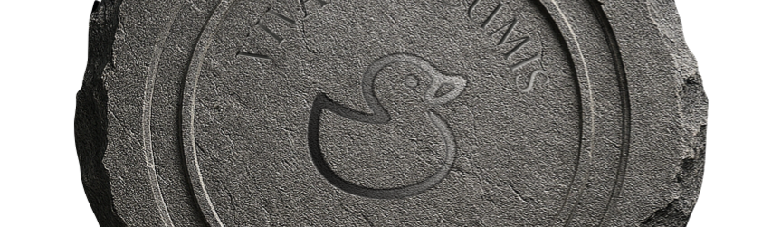

# RDCore™
_Ce document est disponible en [français](./README.fr.md)_

## Before we begin.
> 👋 Hi! New here? _Rubberduck_ was always an open-source initiative. **RDCore honors it with an Open-Core formula**.  
> <small>See [rubberduckvba.ca](https://rubberduckvba.ca) for more information.</small>

This repository contains different projects **under active development** producing different libraries and executables, under a relatively simple licensing model:

- **The RDCore.SDK library** (including its documentation) is licensed under **⚖️MIT**;
- **Everything else** built around it is licensed under **⚖️GPLv3**.

This arrangement protects both the legacy and current contributors while enabling the future: **The RDCore runtime implementation shall remain open-source**.

👉 We're building a solid _language core_ foundation here. The [documentation site](https://rubberduck-vba.github.io/RDCore/index.html) remains the main reference, but the platform is now producing real deliverables: `rdc.exe` carries a workspace from load through parse to symbol definition, end to end.

### In this document
- [Project status](#projectstatus)

### See also
- [CONTRIBUTING.md](CONTRIBUTING.md)
- [CODE_OF_CONDUCT.md](CODE_OF_CONDUCT.md)

---
# RDCore
[RD-VBAL §1.0.1](https://rubberduck-vba.github.io/RDCore/specs/rd-vbal.1.0.introduction.html#101-rdcore)  
**RDCore**™ is an actively evolving _Language Server_ (LSP) platform that is currently a **work in progress**. Ultimately, the RDCore deliverables are:

- 🎯 **rdc.exe**: a configurable and extensible RD-VBA _environment host_ and LSP client CLI application, with a _command mode_ (`rdc.exe <verb>`, e.g. `describe-ext`);
- 🎯 **RDCore.LanguageServer.exe**: the platform's "orchestrator" LSP server application;
- 🎯 **RDCore.ParseServer.exe**: the platform's parser is a satellite LSP server application owned and coordinated by the main language server;
- 🎯 **RDCore.Diagnostics.exe**: a core platform extension asynchronously issuing _diagnostics_ to the main language server;
- 👉 **RDCore.Runtime.dll**: a library containing an implementation for all the RD-VBA runtime semantics and mechanics, _including an implementation of the VBA Standard Library_;
- 🧩 **RDCore.SDK.dll**: a library exposing the RDCore abstractions and encapsulating the base RD-VBA _language core_ implementation.

## ✨ What RDCore could make possible
- **Analyze VBA code** at depths only _LSP analyzers_ can reach
- **Execute** VBA code outside the VBIDE
- **Build dev tools** via the _Language Server Protocol_ (LSP)
- **Inspect runtime** behavior and semantic facts
- **Extend the platform** with analyzers and plugins

<a id="projectstatus"/>

## 📊 Project Status
RDCore is in active **pre-alpha** development. The **specification** and **documentation** are the stable deliverables; the platform runs end to end (workspace → parse → symbols) but is not released yet. A rough picture per project — not issue-tracked, just where things stand:

**RDCore.SDK** — language model + shared plumbing · ✅ stable

| Area | |
|---|---|
| Static type system, runtime type model | ✅ |
| Static semantics — operators, let-coercions | ✅ |
| Hosts, transport, connection lifecycle, platform-root | ✅ |
| Capability model (platform + LSP handshake) | 🚧 informational, no enforcement; CLI + extensions advertise `CliCommand` |

**RDCore.Parsing** → `RDCore.ParseServer.exe` · 🚧

| Area | |
|---|---|
| Full-document parse — directives, declarations, UDT members | ✅ |
| AST statement nodes | 🎯 unblocks the interpreter |
| Anchored-fragment parse | 🎯 |
| `#If` expressions past a bare name · float-literal conformance | 🚧 |

**RDCore.LanguageServer** — orchestrator + LSP server · 🚧

| Area | |
|---|---|
| LSP lifecycle | ✅ |
| Platform orchestration (bring-up, health, teardown) | ✅ core children + discovered extensions |
| Workspace load → parse round-trip → symbol extraction → define | ✅ intrinsic types only |
| LSP document + workspace features | 👉 up for grabs — spec'd |

**RDCore.CLI** → `rdc.exe` — LSP client + environment host · 🚧

| Area | |
|---|---|
| Client mode (`--workspace`) drives the platform end to end | ✅ |
| Runtime session composed from `.rdproj` (`--host`) | ✅ |
| Session symbols (`rdcore/host/symbols/define`) | 🚧 define-only |
| Session memory / allocation model | 🚧 accounting layer; addressable storage planned |
| Command mode — verb dispatch, `describe-ext` | ✅ native + extension command providers |
| Interactive REPL | 🎯 |

**RDCore.Runtime** — RD-VBA runtime semantics + VBA stdlib · 🚧

| Area | |
|---|---|
| Runtime semantics — operators | ✅ |
| Runtime semantics — let-coercions | 🚧 |
| Runtime semantics — set-coercions, statements | 🎯 |
| Standard library (`IStd*`) | 🎯 |
| Interpreter · IR lowering | 🎯 planned |

**RDCore.Diagnostics** — core inspection extension · 🚧 analyzer skeleton; discovered from its generated manifest and brought up by the language server during platform assembly.

**Tests** · 🎯 target ~70% line coverage (badge above is live) — operator semantics and platform lifecycle well covered; parser grammar and CLI thin; runtime beyond operators has nothing to cover yet.

**Contributions** — individuals ✅ open ([CLA](CLA.md)) · corporate ⏳ planned

✅ done / stable · 🚧 in progress · 🎯 not started · 👉 up for grabs

<a href='https://rubberduck-vba.github.io/RDCore/index.fr.html'>ACCUEIL</a> • <a href='https://rubberduck-vba.github.io/RDCore/index.html'>HOME</a>  | ℹ️ <a href='https://rubberduck-vba.github.io/RDCore/introduction.fr.html'>BIENVENUE</a> • <a href='https://rubberduck-vba.github.io/RDCore/introduction.html'>WELCOME</a>  | 🧩 <a href='https://rubberduck-vba.github.io/RDCore/getting-started.fr.html'>BÂTISSONS</a> • <a href='https://rubberduck-vba.github.io/RDCore/getting-started.html'>BUILD</a>  | <a href='https://rubberduck-vba.github.io/RDCore/specs/rd-vbal.html'><strong>RD-VBAL</strong></a>  |  <a href='https://rubberduck-vba.github.io/RDCore/api/RDCore.SDK.Model.Errors.VBCompileErrorId.html'>SDK</a>  | 🌐 <a href='https://rubberduckvba.ca'>rubberduckvba.ca</a>

<h6 align='center'>V I V A T ❤️ C U C U M I S ™</h6>

<small>© Copyright <strong>9562-7303 Québec inc.</strong> (2026) <em>Seul, &quot;Rubberduck&quot; est utilisé pour fins de référence au projet open-source legacy <strong>utilisé publiquement ainsi depuis 2015</strong> et sans lien ni affiliation avec tout tiers détenteur d'une marque semblable dans quelque juridiction que ce soit. &quot;Rubberduck VBA&quot;, &quot;RDCore&quot; et &quot;VIVAT CUCUMIS&quot; sont des marques de commerce revendiquées par 9562-7303 Québec inc. (en attente); Toutes les marques appartiennent à leur détenteur respectif. RDCore n'est pas un produit de Microsoft et n'est pas affilié à Microsoft, ni directement, ni indirectement.  If used alone, <em>&quot;Rubberduck&quot; is used as a reference to the legacy open-source project <strong>the same way it has been used publicly since 2015</strong> and without any links or affiliation with any third-party trademark holders of a similar trademark in any jurdisdiction. &quot;Rubberduck VBA&quot;, &quot;RDCore&quot; and &quot;VIVAT CUCUMIS&quot; are trademarks claimed by 9562-7303 Québec inc. (pending). All trademarks belong to their respective owners. RDCore is not a Microsoft product and is not affiliated with Microsoft, directly or indirectly.</small>

