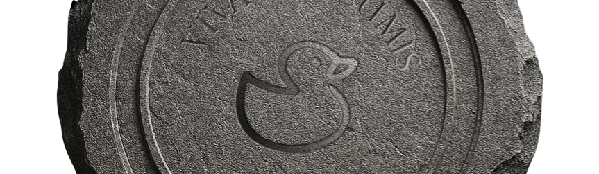

# RDCore SDK 
_This document is available in [English](index.html)_

---
## Bienvenue!

**RDCore** ("Rubberduck Core") est le successeur spirituel de **Rubberduck VBA**™, projet open-source _legacy_ populaire (2015-2025, aujourd'hui [archivé](https://github.com/rubberduck-vba/Rubberduck)). 

❌ **RDCore n'est PAS** un add-in pour le VBIDE.  
✅ **RDCore est une nouvelle implémentation de VBA** à partir de ses spécifications.  

👉 Legacy VBA aujourd'hui :  
- règles implicites
- difficile à analyser
- figé dans son runtime
- impossible à faire évoluer

👉 **RDCore** :  
- **formalise** les sémantiques
- **expose** les structures
- **rend observable** l'exécution
- **rend extensible** le langage même

👉 **Référentiel et état du projet** (GitHub): [rubberduck-vba/RDCore](https://github.com/rubberduck-vba/RDCore)

### Objectifs
- 🎯 **Implémentation intégrale** de la spécification MS-VBAL
- 🎯 Implémentation d'une **librairie runtime indépendante** de MS-VBA
- 🎯 Publication d'une **spécification RD-VBA** officielle
- 🎯 Implémentation d'un écosystème _Language Server_ (LSP) et **plateforme analytique** pour RD-VBA

---
## Documentation

La documentation de la section **SDK** de ce site est générée à partir des commentaires (xmldoc) directement dans le code source, et n'est donc **disponible qu'en anglais** afin d'en maximiser la portée et d'en réduire l'importante empreinte.

À l'exception de la spécification/documentation de la plateforme de langage et de son SDK (**RD-VBAL**), tout contenu non directement issu du code source est disponible en français.

Bonne lecture!

---
ACCUEIL • [HOME](index.md) | ℹ️ [BIENVENUE](introduction.fr.md) • [WELCOME](introduction.html) | 🧩 [BÂTISSONS](getting-started.fr.md) • [BUILD](getting-started.html) | [**RD-VBAL**](/specs/rd-vbal.html) | [SDK](/api/RDCore.SDK.Model.Errors.VBCompileErrorId.html) | 🌐 [rubberduckvba.ca](https://rubberduckvba.ca)

---
